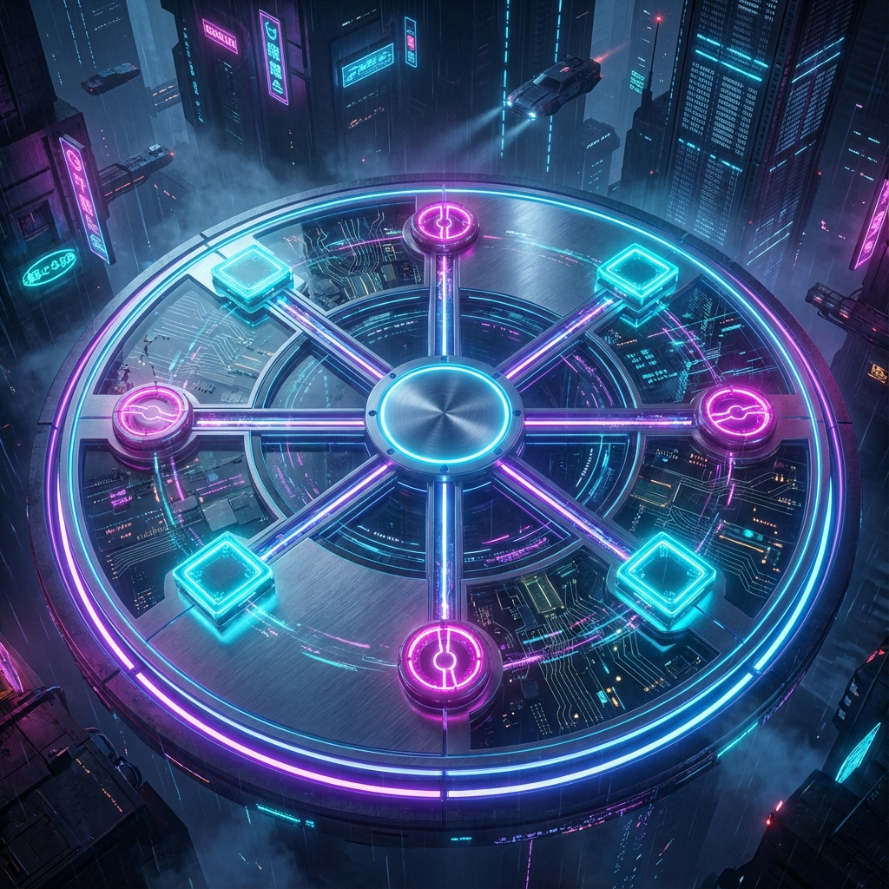

# 🎮 Bina Codes Game Dashboard

A premium, modern gaming platform featuring classic strategy board games with stunning visuals and smooth animations. Built with Next.js and featuring a sleek dark-mode interface.



## 🌟 Features

### Current Games
- **ROTA** - Master the ancient Roman game of strategy
- **Nine Men's Morris** - Classic mill game with strategic positioning
- **Ultimate Tic-Tac-Toe** - Recursive tic-tac-toe requiring 9-dimensional thinking
- **Othello (Reversi)** - Strategic disc-flipping gameplay
- **Dots & Boxes** - Territory capture through line connections

### Dashboard Features
- 🎨 **Dynamic Hero Carousel** - Auto-rotating showcase of all games
- 🖼️ **Premium Game Banners** - High-quality cinematic artwork for each game
- 🎯 **Responsive Design** - Optimized for all screen sizes
- 🌙 **Dark Mode** - Eye-friendly gaming aesthetic
- ⚡ **Smooth Animations** - Powered by Framer Motion
- 🎮 **AI Opponents** - Play against intelligent game engines

### Technical Features
- Server-side rendering with Next.js 16
- Component-based architecture
- Unified game lobby system
- Custom branding (Logo & Favicon)
- Hydration-optimized rendering

## 🛠️ Tech Stack

### Current Implementation
- **Framework:** Next.js 16.1.6 with Turbopack
- **Language:** TypeScript
- **Styling:** Tailwind CSS
- **UI Components:** Shadcn/UI
- **Animations:** Framer Motion
- **Icons:** Lucide React
- **Font:** Inter (Google Fonts)

### Development Tools
- ESLint for code quality
- PostCSS for CSS processing
- TypeScript for type safety

## 🚀 Getting Started

### Prerequisites
- Node.js 18+ 
- npm or yarn

### Installation

1. Clone the repository
```bash
git clone https://github.com/Motasaith/game-dashboard.git
cd game-dashboard
```

2. Navigate to client directory
```bash
cd client
```

3. Install dependencies
```bash
npm install
```

4. Run the development server
```bash
npm run dev
```

5. Open [http://localhost:3000](http://localhost:3000) in your browser

### Build for Production
```bash
npm run build
npm start
```

## 📁 Project Structure

```
game-dashboard/
├── client/
│   ├── public/
│   │   └── assets/          # Game banners and images
│   ├── src/
│   │   ├── app/
│   │   │   ├── page.tsx     # Main dashboard
│   │   │   ├── layout.tsx   # Root layout with sidebar
│   │   │   ├── icon.tsx     # Dynamic favicon
│   │   │   └── game/        # Game pages
│   │   ├── components/
│   │   │   ├── games/       # Game components
│   │   │   │   ├── rota/
│   │   │   │   ├── morris/
│   │   │   │   ├── ultimate-ttt/
│   │   │   │   ├── othello/
│   │   │   │   └── dots-boxes/
│   │   │   └── ui/          # Shadcn UI components
│   │   └── lib/
│   │       ├── aiEngine.ts  # AI opponent logic
│   │       └── utils.ts     # Utility functions
│   └── package.json
└── README.md
```

## 🎯 Future Roadmap

### Phase 1: Game Expansion 🎲
- [ ] **Chess** - Classic chess with AI difficulty levels
- [ ] **Checkers** - Traditional checkers gameplay
- [ ] **Backgammon** - Dice-based strategy game
- [ ] **Go** - Ancient Asian strategy game
- [ ] **Connect Four** - Vertical strategy game
- [ ] **Mancala** - African stone-capturing game

### Phase 2: Serverless Backend & User System 👤

#### Recommended Technology Stack

| Feature | Recommended Tool | Why? |
|---------|-----------------|------|
| **Framework** | Next.js 14/15 | Acts as your frontend and handles "serverless" API routes if needed |
| **User & Profile** | Clerk | Handles the "BinaPlayer" profile, Login, Logout, and friends logic effortlessly |
| **Database** | Convex or Supabase | Stores your "Library," game stats, and friend lists. Direct access from frontend code |
| **Styling/UI** | Tailwind CSS + Shadcn/ui | Essential for that clean, dark-mode "gaming" aesthetic ✅ (Already Implemented) |
| **Multiplayer/Social** | Liveblocks or Ably | Powers the "Friends Online" status and real-time game moves |

#### Features to Implement
- [ ] **User Authentication** (via Clerk)
  - BinaPlayer profiles
  - Social login (Google, GitHub, Discord)
  - Secure session management
  
- [ ] **Database Integration** (Convex/Supabase)
  - User game library
  - Match history & statistics
  - Leaderboards
  - Achievement tracking
  - Personal game settings

- [ ] **Social Features**
  - Friend system
  - Online status tracking
  - Friend invitations
  - Player search

### Phase 3: Real-time Multiplayer 🌐
- [ ] **Live Game Sessions** (Liveblocks/Ably)
  - Real-time PvP matches
  - Spectator mode
  - Game invitations
  - Turn notifications
  
- [ ] **Chat System**
  - In-game messaging
  - Lobby chat
  - Friend messaging

### Phase 4: Enhanced Features ⚡
- [ ] **Game Replays** - Save and review past matches
- [ ] **Tournaments** - Organized competitive play
- [ ] **Daily Challenges** - New puzzles and scenarios
- [ ] **Achievements & Badges** - Gamification system
- [ ] **Custom Themes** - Personalized UI customization
- [ ] **Mobile App** - React Native companion app

### Phase 5: AI & Analytics 🤖
- [ ] **Advanced AI**
  - Multiple difficulty levels
  - Adaptive AI that learns player style
  - AI personality variations
  
- [ ] **Analytics Dashboard**
  - Win/loss statistics
  - Performance metrics
  - Skill rating (ELO system)
  - Game insights

## 🎨 Design Philosophy

- **Premium Aesthetic:** Cinematic visuals with neon accents
- **Performance First:** Optimized rendering and smooth 60fps animations
- **Accessibility:** Keyboard navigation and screen reader support
- **Responsive:** Mobile-first design approach
- **Dark mode:** Eye-friendly interface for extended gaming sessions

## 📝 License

This project is open source and available under the [MIT License](LICENSE).

## 👨‍💻 Author

**Bina Codes**
- GitHub: [@Motasaith](https://github.com/Motasaith)

## 🤝 Contributing

Contributions, issues, and feature requests are welcome! Feel free to check the [issues page](https://github.com/Motasaith/game-dashboard/issues).

## ⭐ Show Your Support

Give a ⭐️ if you like this project!

---

**Built with ❤️ using Next.js, TypeScript, and Tailwind CSS**
